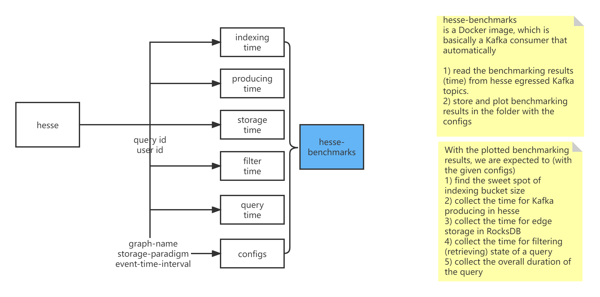

# hesse-benchmarks



## Build

```shell
docker build . -t spycsh/hesse-benchmarks
docker run -d -v /app:/mnt -e 'APP_KAFKA_HOST=kafka:9092' -it spycsh/hesse-benchmarks
docker commit <container_id> spycsh/hesse-benchmarks
docker push spycsh/hesse-benchmarks
```

## How to use

```yaml
version: '2.1'
services:
  ... # other services
  hesse-benchmarks:
    image: spycsh/hesse-benchmarks:latest
    depends_on:
      - kafka
    links:
      - kafka:kafka
    environment:
      APP_KAFKA_HOST: kafka:9092
      APP_KAFKA_TOPICS: 'indexing-time producing-time storage-time filter-time query-results'
    volumes:
    - ./benchmarks:/app/results
```